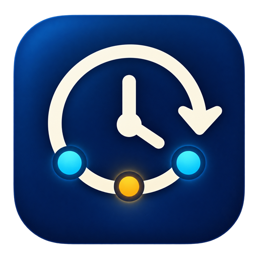
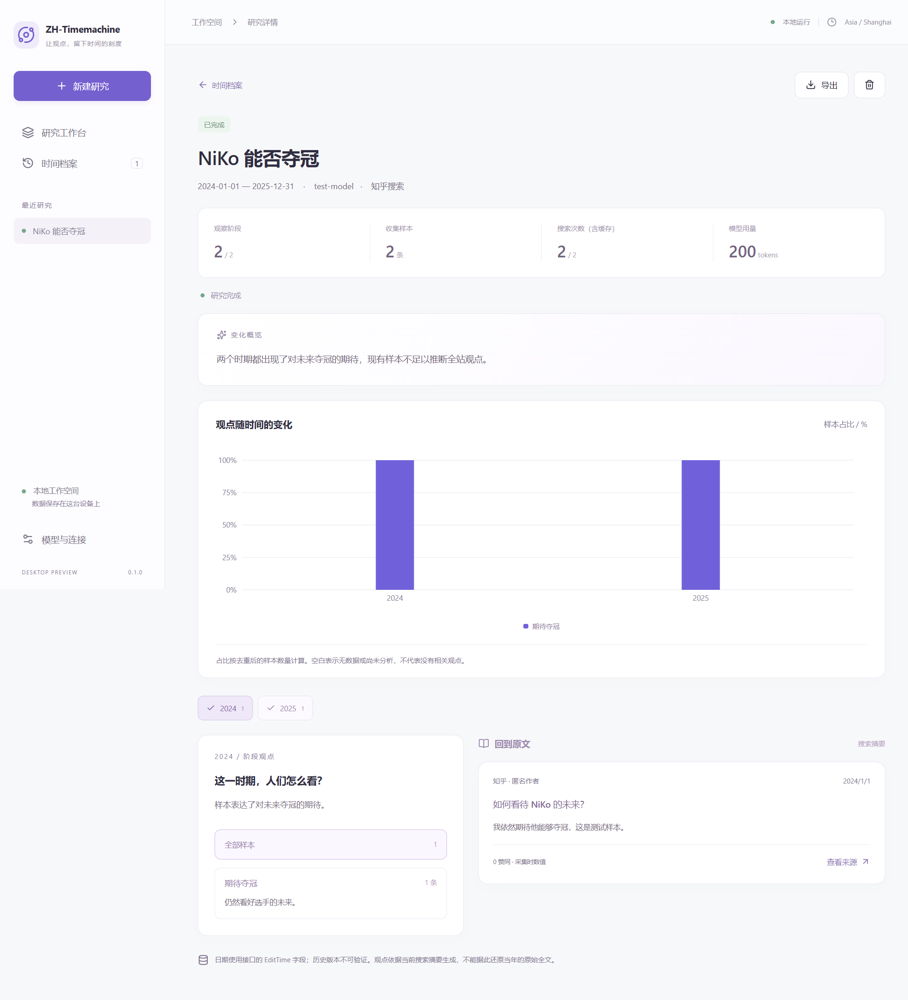

<div align="center">



# ZH-Timemachine

**让观点回到它发生的时间。**

输入一个问题，沿着时间线，看看答案如何变化。

[](https://github.com/nahc2o4/zh-timemachine/releases/latest)
[](LICENSE)
[](package.json)
[](docs/DEVELOPMENT.md)

[下载使用](https://github.com/nahc2o4/zh-timemachine/releases/latest) · [功能亮点](#功能亮点) · [快速开始](#快速开始) · [开发指南](docs/DEVELOPMENT.md) · [反馈问题](https://github.com/nahc2o4/zh-timemachine/issues)

<sub>2026 知乎黑客松参赛项目</sub>

</div>

---

## 为什么做一台观点时光机？

同一个问题，在不同时间，可能得到截然不同的回答。关于一位选手的期待、某项技术的争论、一个产品的评价——我们想看到的不只是今天的结论，还有它一路走来的变化。

**ZH-Timemachine** 是一个在本地运行的研究 Agent：通过知乎开放平台搜索内容，借助 LLM 整理各阶段的观点，再把趋势与原文证据放回同一条时间线。

## 界面预览

<div align="center">
  
  <br />
  <sub>桌面应用真实截图 · 使用模拟数据展示研究流程，不代表真实研究结论。</sub>
</div>

## 功能亮点

| | 能做什么 |
| --- | --- |
| **按时间研究** | 输入问题与日期范围，分阶段检索，观察观点随时间的变化。 |
| **选择搜索来源** | 在设置中选择知乎搜索或全网搜索；切换后用于新研究。 |
| **模型辅助归纳** | 自动规划关键词、归类样本、整理阶段总结。支持 DeepSeek 与 OpenAI 兼容服务。 |
| **图表连接证据** | 查看观点分布，点击回看对应样本与原文来源。 |
| **随时暂停回看** | 支持取消、继续分析、查看历史记录和导出研究 JSON。 |
| **本地保存** | 研究与缓存保存在本机，凭证通过系统安全存储加密，无需部署服务器。 |

## 快速开始

### 1. 下载并打开

从 [Releases](https://github.com/nahc2o4/zh-timemachine/releases/latest) 下载 Windows 便携版 `.exe`，打开即可使用。

### 2. 配置连接

在 **模型与连接** 中：

- 填写知乎开放平台 Access Secret，并选择知乎搜索或全网搜索。
- 添加模型供应商，填写 API Key、模型名与 Base URL。
- OpenAI 兼容地址通常以 `/v1` 结尾，不要填写完整的 `/chat/completions` 路径。

### 3. 开始研究

输入你关心的问题，选择日期范围与模型，启动研究。完成后，从时间线查看各阶段的主要观点，并打开证据核对来源。

> 研究数据保存在本地；搜索与模型分析需要联网并调用对应 API，费用取决于服务供应商。

## 从源码运行

需要 **Node.js 24** 和 **Git**。

```sh
git clone --branch main https://github.com/nahc2o4/zh-timemachine.git
cd zh-timemachine
npm ci
npm run dev
```

<details>
<summary><strong>构建、测试与打包</strong></summary>

| 命令 | 说明 |
| --- | --- |
| `npm run doctor` | 检查工具链 |
| `npm run build` | 类型检查并构建 |
| `npm test` | 运行单元测试 |
| `npm run test:desktop` | 桌面模拟联调，并生成截图 |
| `npm run dist:win` | 打包 Windows 便携版，输出至 `release/` |
| `npm run dist:mac` | 打包 macOS DMG，需在 macOS 验证 |
| `npm run dist:linux` | 打包 Linux AppImage，需在 Linux 验证 |

Windows PowerShell 如限制 `npm.ps1`，请使用 `npm.cmd`。目前仅在 Windows 验证；签名、公证及自动更新尚未配置。

更多架构、数据存储与测试说明见 [开发指南](docs/DEVELOPMENT.md)。图标源文件及生成说明见 [图标资源](assets/README.md)。

</details>

## 如何理解研究结果

- **观点分布描述检索样本**，不代表知乎全站或全网的总体意见。
- 分析依据搜索摘要；内容时间字段与历史修改版本存在不确定性，赞同数为采集时的值。
- 跨时期的观点差异，不等于同一位作者改变了看法。建议结合原文证据判断。

## 参与项目

欢迎通过 [Issues](https://github.com/nahc2o4/zh-timemachine/issues) 反馈问题或提出建议，也欢迎提交 Pull Request。反馈时请附上复现步骤与运行环境，并移除 API Key 等敏感信息。

## 许可

本项目采用 [MIT License](LICENSE)。

<div align="center">
  <sub>一个问题，一段时间，一次重新理解。</sub>
</div>
